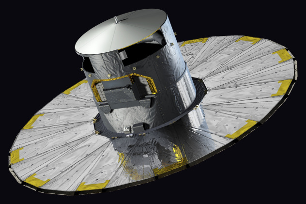
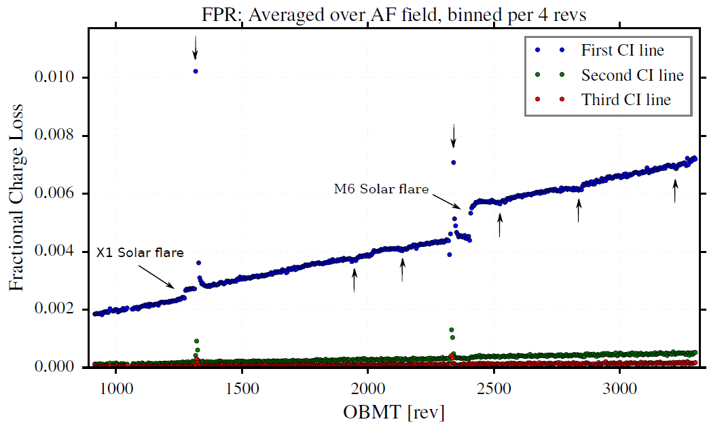
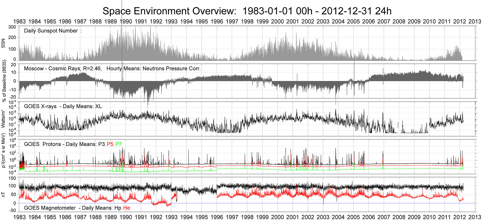
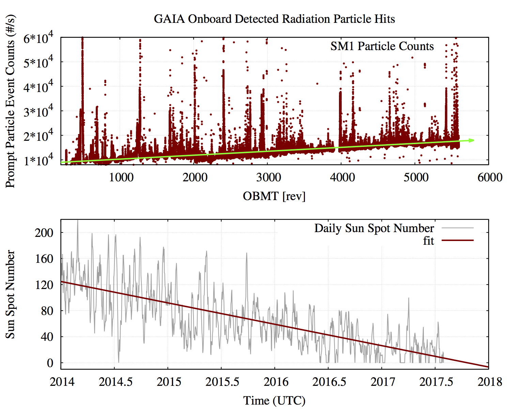

# Cosmic Rays in Gaia Data 

## Introduction 

High energy particle radiation in space (a.k.a. cosmic rays) poses a risk to both the safety of human space activites as well as for satellite hardware components and causes radiation damage that can lead to either malfunctioning or progressive degradation of electronic components and sensing devices like CCDs.

Most cosmic rays are originated within our solar system, have relatively low energy and come from explosive events on the sun, like flares and coronal mass ejections. On the other side, the highest-energy cosmic rays are extremely rare, come from outside our solar system but within our Galaxy and are called galactic cosmic rays.  

Galactic Cosmic Rays (GCRs) generated outside the Solar System are primarily composed of high-energy protons (~ 90%) and alpha particles ( ~9%) with some heavier nuclei in smaller fractions ( ~1%) and their energies range from a few GeV up to 1011  GeV, showing typical fluxes of 1 to 10 particles cm-2 s-1.

Solar energetic partcles are released by the Sun via two mechanisms, solar wind and solar particle events (Solar Flares and Coronal Mass Ejections), the later producing massive amounts of (low energy) cosmic rays.   These solar phenomena (wind and SPEs) have energies -per particle- typically smaller than GCRs and in the range (0.1 MeV - 103 MeV). Here, protons constitute the bulk of the radiation particles (~ 96%) with (~4%) of alpha particles and a smaller trace component of heavier nuclei; particle fluxes can vary event to event but are typically much higher than GCRs, ~ 104  particles cm-2 s-1.

Both components of the cosmic rays cause radiation damage (permanent or displacement) damage in the electronic sensing devices (CCDs) onboard spacecrafts. 

Radiation damage effects (in particular displacement damage) caused by those two components of the cosmic rays (Solar Particles and GCRs) can be seen in the following figure from Gaia CCDs Charge Transfer Inefficiency (CTI) evolution analysis.:

* A 'semi-constant' degradation caused by the GCRs is detected by the constante change (slope) in the measured CTI.

* Ocassional abrupt changes  are caused by extreme Solar Particle Events (marked by 'Solar Flare') occurred since Gaia was launched in Dec 2013

CTI Evolution with OBMT:

It is known that the GCR component of the cosmic rays shows a periodic variation along the solar cycle, an anti-correlation with solar activity that is caused by the varying strength of the solar magnetic field withing the solar cycle.  A stronger magnetic field (during maximum) diffuses more efficiently galactic cosmic rays impeding them reaching the inner parts of the Solar System, thus producing lower fluxes of GCRs during maximum and viceversa. Such anticorrelation can be seen in the following long-term combined plot which includes data from solar activity over ~ 3 solar cycles (measured by Daily Sunspot numers) , Cosmic ray fluxes measured at Earth and space based radiation monitoring facilities like NASA's GOES spacecraft.

This anti-correlation has also been observed in Gaia when analyzing the cosmic ray hit counts produced by Gaia telemetry along the mission timeline since the launch in Dec 2013 (at Solar maximum). 

The following is a long term plot of the Prompt Particle Event counters (or PPE counts) at L2 generated by the VPU detection algorithms onboard Gaia, that shows an increasing level of Galactic Cosmic ray hits (the pedestal) on top of which solar particle events shows as peaks, as we progress onto solar minimum, i.e, decrease solar activity.  Note that that PPE counters are a by-product of the onboard autonomous detection chain and hence a 'proxy' for cosmic ray counts not a direct measurement.

Prompt Particle Events Evolution with OBMT:

## Gaia Available Datasets

We will use several data sources from Gaia telemetry for the study of the cosmic rays as seen by Gaia in L2. We will primarily analyze the frequency of cosmic rays hits in Gaia CCDs to extract time series, but also and potentially extract the average energy depletion per hit.  

The following table summarizes these data sources, its sampling frequency and further details.

* Note (1): gbin (gaia binary) is the default data format for storing compressed Gaia generated telemetry. 
* Note (2): the method for accessing this datasets is still TBD and depends on the volume of each  subset.

|Data Source | Sampling Frequency | Type of Information | Data Format|
|------------| -------------------| --------------------| -----------| 
|ASD PPE couters|~ 1 / 4 min.|counts/s|gbin|
|SIF SM|~ 1 / 2 hours |counts/s and deposited energy (e-)|FITS / gbin|
|SIF BAM|~ 2 / week|counts/s and deposited energy (e-) | FITS / gbin |
|SIF SM Charge Injection|~ 1 / 3-4 months|counts/s and deposited energy (e-)|FITS / gbin|
|SIF Outreach/'Super'|Occassional|counts/s and deposited energy (e-)|FITS / gbin|
|BAM data|~ 2 / few seconds|counts/s and deposited energy (e-)|gbin|
|VO 1D| ~ ? |counts/s and deposited energy (e-)|gbin|
|VO SM| ~ ? |counts/s and deposited energy (e-)|gbin|
|Nominal 2D Windows|variable very high rate|counts/s and deposited energy (e-)|gbin|

## Project Phases (Objectives)

The project will be divided in two phases:  

### Phase #1 : 

#### Objective:  

Extraction of time series of cosmic rays from Gaia datasets to obtain an homogeneous (as possible) and high frequency sample of cosmic rays measurement at L2 by Gaia since the start of the mission.  

#### Input dataset:  

Will primarily consist of SIF images SM, BAM, etc, over which we will apply existing outlier removal algorithms (LA cosmics) -or a TBD algorithm- for retrieving time series of cosmic rays. 

#### Expected outputs
Time series of cosmic ray counts. Outputs will be used for internal cross correlation to other Gaia data sources (like the ASD PPE counters). 

Potentially : obtain the distribution of deposited energies, through electron counting.  distribution of deposited energies with time → any time dependency of this energy distribution? 

#### Expected Duration: ~ 3/4 months

### Phase #2: 

#### Objective: 

Retrieval of particle count rates data from external satellites for a both qualitative and quantitative comparison to the results extracted in Phase #1. 

#### Input dataset: 

Publicly available NASA and ESA satellite data from radiation monitoring instruments.

#### Expected outputs: 

Relative comparisons of satellite data on equivalent timeframes at different positions in the Sun-Earth-L2 path, can give a better idea of the distribution of cosmic rays in the interplanetary medium and allow a comparison to existing models of cosmic ray distribution.

#### Expected Duration:   ~ 3/2 months

## Useful Resources

* [General Spacecraft Info](https://gaia.esac.esa.int/documentation//GDR1/Introduction/chap\_intro\_intro\_chapter/sec\_mission.html#SS3) Information on the Focal Plane Assembly and Video Processing Units
* [OBMT Decoder](https://gaia.esac.esa.int/decoder/obmtDecoder.jsp) provides conversion between UTC and Gaia Onboard Mission Time (OBMT)
* [Cosmic Rays from BAM](https://gea.esac.esa.int/archive-doc/crays/index.html) Cosmic Rays in Gaia Data as extracted from BAM data
* [SPENVIS](https://www.spenvis.oma.be/) SPace ENVironment Information System, models of the space environment and its effects
* [LA Cosmics code](http://www.astro.yale.edu/dokkum/lacosmic/) Laplacian Cosmic Ray Identification

## Reference Documentation

* [Radiation and Cosmics from Gaia at L2 TN](https://gaia.esac.esa.int/dpacsvn/DPAC/DPCE/docs/Calibration/AAA-035-Cosmics/) Technical note on the analysis of cosmics as detected by Gaia at L2 around 2 years after launch. 

## Sample Code 

Very basic sample (python) code to read in and display a few Gaia FITS images is available under demo directory. 
Generic matplotlib settings are under templates directory.
